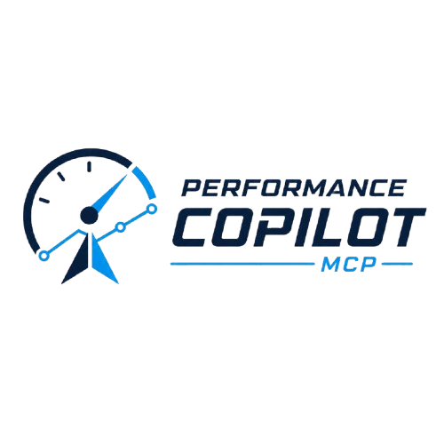
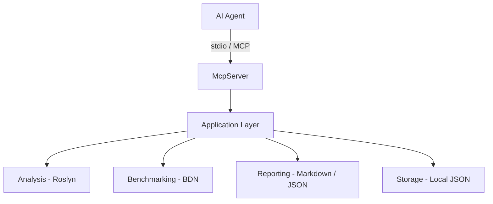

<div align="center">
  <br/><br/>

  <h1>Performance Copilot MCP</h1>

  <p>A Model Context Protocol server that brings automated .NET performance analysis<br/>and BenchmarkDotNet execution into any AI-assisted development workflow.</p>

  <p>
    
    
    
    
    
  </p>
</div>

---

## Overview

Performance Copilot MCP is a local [Model Context Protocol](https://modelcontextprotocol.io) server for .NET applications. It exposes ten tools that an AI agent can invoke to analyze a .NET solution, identify performance-critical methods through Roslyn static analysis, generate BenchmarkDotNet benchmark classes, execute benchmarks in a controlled environment, and produce structured performance reports with baseline regression detection.

The design philosophy centers on intelligent discovery over manual selection. The agent does not require the developer to identify what to benchmark. The Roslyn analysis engine scores every non-trivial method against a set of detection rules and returns a ranked candidate list, from which the agent proceeds autonomously through the full benchmarking lifecycle.

The server communicates exclusively over **stdio**, routing all diagnostic output to **stderr** to prevent channel pollution. The workspace root is supplied as a positional argument at startup and enforced by `WorkspaceGuard` for the duration of the session.

---

## Table of Contents

- [Architecture](#architecture)
- [Tools Reference](#tools-reference)
- [Roslyn Detection Rules](#roslyn-detection-rules)
- [Security Model](#security-model)
- [Prerequisites](#prerequisites)
- [Installation](#installation)
- [Configuration](#configuration)
  - [VS Code](#vs-code)
  - [Claude Desktop](#claude-desktop)
- [Typical Workflow](#typical-workflow)
- [Patch Notes](#patch-notes)
- [License](#license)

---

## Architecture

The solution consists of six .NET projects organized in a layered architecture. The `McpServer` project is the only process boundary; all other projects are class libraries referenced by the application layer.

```
+--------------------------------------------------+
|               AI Agent / LLM                     |
|       (VS Code Copilot, Claude Desktop)          |
+--------------------+-----------------------------+
                     | MCP Protocol (stdio)
+--------------------v-----------------------------+
|          PerformanceCopilot.McpServer            |
|   Tools  |  Security Guards  |  DI Host          |
+-----+----------+----------+----------+----------+
      |          |          |          |
+-----v--+ +-----v--+ +-----v--+ +-----v--+
|Analysis| |Benchmk.| |Reportg.| |Storage |
|(Roslyn)| |(BDN)   | |(MD/JSON| |(JSON FS|
+--------+ +--------+ +--------+ +--------+
      |          |          |          |
+--------------------------------------------------+
|           PerformanceCopilot.Application         |
|           Use Cases  |  Contracts  |  Services   |
+--------------------------------------------------+
```



| Project | Responsibility |
|---------|---------------|
| `PerformanceCopilot.McpServer` | MCP host, tool registration, security guards, DI wiring |
| `PerformanceCopilot.Application` | Use cases, request/response contracts, domain services |
| `PerformanceCopilot.Analysis` | Roslyn MSBuildWorkspace integration, detection rules, scoring |
| `PerformanceCopilot.Benchmarking` | BenchmarkDotNet code generation and process execution |
| `PerformanceCopilot.Reporting` | Markdown and JSON report generation |
| `PerformanceCopilot.Storage` | Local JSON persistence for history, baselines, and session state |

---

## Tools Reference

| Tool | MCP Name | Description |
|------|----------|-------------|
| Server Info | `server_info` | Returns server status, version, active workspace path, artifacts path, and runtime configuration. |
| Discover Candidates | `discover_benchmark_candidates` | Loads a .NET solution via MSBuildWorkspace, applies Roslyn detection rules to every method, and returns a ranked list of benchmark candidates with composite scores and pattern justification. |
| Generate Plan | `generate_benchmark_plan` | Transforms a selection of candidate IDs into a structured benchmark execution plan, including job configuration, diagnoser selection, exporter configuration, and fixture strategies. |
| Create Project | `create_benchmark_project` | Scaffolds a new .NET project on disk with BenchmarkDotNet, global usings, and configured exporters based on the generated plan. |
| Generate Fixture | `generate_benchmark_for_candidate` | Emits a BenchmarkDotNet fixture class for a specific candidate method, inferring constructor parameters and method signatures from the Roslyn type model. |
| Run Benchmark | `run_benchmark` | Invokes `dotnet run -c Release` on the benchmark project, captures structured output, and returns time, memory allocation, and GC metrics per method. |
| Analyze Results | `analyze_benchmark_results` | Interprets a completed benchmark run from the history store and returns technical findings with bottleneck identification and actionable optimization suggestions. |
| Generate Report | `generate_performance_report` | Produces a full Markdown performance report from one or more benchmark runs, including per-method summary tables and historical trend data. |
| Save Baseline | `save_baseline` | Persists a benchmark run as a named baseline on the local filesystem under the artifacts directory for future regression comparison. |
| Compare Baseline | `compare_with_baseline` | Compares a current benchmark run against a saved named or run-ID baseline and reports per-method regressions and improvements using configurable time and memory thresholds. |

---

## Roslyn Detection Rules

The analysis engine applies seven independent detection rules to every non-trivial method. Each rule contributes to a composite score that determines the candidate priority ranking returned by `discover_benchmark_candidates`.

| Rule | Signals Detected |
|------|-----------------|
| `LoopDetectionRule` | `for`, `foreach`, `while`, `do-while` constructs; nested loop depth multiplier applied to score |
| `LinqDetectionRule` | LINQ method chains; deferred vs. materialized execution patterns; chained projection costs |
| `AllocationDetectionRule` | `new` expressions; array and collection instantiation; boxing conversions; LINQ materialization |
| `StringOperationDetectionRule` | String concatenation with `+`; `string.Format` calls; interpolated string expressions in loops |
| `SerializationDetectionRule` | `JsonSerializer`, `XmlSerializer`, `DataContractSerializer` invocations |
| `EfCoreDetectionRule` | EF Core query expressions; `SaveChanges` calls; N+1 navigation property access patterns |
| `ExternalDependencyDetectionRule` | `HttpClient` invocations; ADO.NET command execution; external service call sites |

---

## Security Model

Two guards are registered as singletons in the DI container and injected into every tool that performs file system or process I/O:

**`WorkspaceGuard`**

Validates that every path argument resolves, via `Path.GetFullPath`, to a descendant of the workspace root supplied at server startup. Any path traversal attempt raises `UnauthorizedAccessException` before the analysis or file operation begins. The allowed root is immutable for the lifetime of the process.

**`CommandExecutionGuard`**

Restricts process execution to an allow-list of known-safe `dotnet` subcommands. No arbitrary command execution is permitted through any tool. All subprocess invocations go through `DotnetCommandRunner`, which validates the command against the guard before spawning.

The server exposes no network surface. All MCP communication occurs over the local stdio pipe established by the host. Logs are written exclusively to stderr.

---

## Prerequisites

| Requirement | Minimum Version |
|-------------|----------------|
| .NET SDK | 10.0 |
| MSBuild | Bundled with .NET 10 SDK |
| PowerShell | 5.1 (setup scripts) |
| OS | Windows (setup scripts); Linux/macOS supported for manual build |

---

## Installation

### Automated Setup (Recommended)

Run the setup script from the repository root. It builds the server in Release configuration and writes the MCP entry to the VS Code global configuration file.

```powershell
.\setup-vscode.ps1
```

To also configure Claude Desktop:

```powershell
.\setup.ps1 -ConfigureClaudeDesktop
```

To reconfigure the MCP client entry without rebuilding:

```powershell
.\setup-vscode.ps1 -SkipBuild
```

### Manual Build

```powershell
dotnet build PerformanceCopilot.slnx -c Release
```

The compiled binary will be located at:

```
src/PerformanceCopilot.McpServer/bin/Release/net10.0/PerformanceCopilot.McpServer.exe
```

### Running Tests

```powershell
dotnet test PerformanceCopilot.slnx -c Release
```

---

## Configuration

### VS Code

Add the following server entry to `%APPDATA%\Code\User\mcp.json`:

```json
{
  "servers": {
    "performance-copilot": {
      "type": "stdio",
      "command": "C:\\path\\to\\PerformanceCopilot.McpServer.exe",
      "args": ["${workspaceFolder}"]
    }
  }
}
```

The `${workspaceFolder}` token is resolved by VS Code at startup to the absolute path of the active workspace. This path becomes the `WorkspaceGuard` boundary for the MCP session.

To use the development mode (slower startup, no rebuild required after code changes):

```json
{
  "servers": {
    "performance-copilot": {
      "type": "stdio",
      "command": "dotnet",
      "args": [
        "run",
        "--project",
        "C:\\path\\to\\src\\PerformanceCopilot.McpServer",
        "--",
        "${workspaceFolder}"
      ]
    }
  }
}
```

### Claude Desktop

Add the following entry to `%APPDATA%\Claude\claude_desktop_config.json`:

```json
{
  "mcpServers": {
    "performance-copilot": {
      "command": "C:\\path\\to\\PerformanceCopilot.McpServer.exe",
      "args": ["C:\\path\\to\\your\\solution-workspace"]
    }
  }
}
```

---

## Typical Workflow

A complete analysis and benchmarking cycle involves the following sequence of tool invocations. The AI agent handles orchestration autonomously after the initial prompt.

```
1.  server_info                      Verify the server is active and confirm workspace path
2.  discover_benchmark_candidates    Receive scored, ranked candidate list from Roslyn analysis
3.  generate_benchmark_plan          Select candidates and configure jobs, diagnosers, exporters
4.  create_benchmark_project         Scaffold the BenchmarkDotNet project on disk
5.  generate_benchmark_for_candidate Emit a fixture class for each target method
6.  run_benchmark                    Execute in Release mode and collect time/memory/GC metrics
7.  analyze_benchmark_results        Interpret findings and receive optimization guidance
8.  generate_performance_report      Produce the full Markdown and JSON performance report
9.  save_baseline                    Persist the run as a named reference baseline
10. compare_with_baseline            Detect regressions after subsequent code changes
```

To initiate this workflow from a chat interface:

```
Analyze the performance of my solution and generate a full benchmark report.
Use the performance-copilot MCP server.
```

Artifacts are persisted to `.performance-copilot/` inside the workspace root by default. This path is configurable via `PerformanceCopilotOptions.ArtifactsBasePath`.

---

## Patch Notes

### v0.7.0

Added baseline management and performance regression detection.

- `save_baseline` tool: persists a benchmark run as a named baseline in the local artifact store with optional description metadata.
- `compare_with_baseline` tool: computes per-method metric diffs against a saved baseline and reports regressions and improvements using configurable time and memory thresholds.
- New types: `BaselineMetadata`, `BaselineStore`, `RegressionDetector`, `MetricSnapshot`, `MethodComparisonResult`, `MetricDiff`.
- `CompareWithBaselineUseCase` and `CompareWithBaselineTool` implemented.
- `CompareWithBaselineRequest` and `CompareWithBaselineResponse` contracts added.

### v0.6.0

Added post-execution analysis, structured reporting, and benchmark history.

- `analyze_benchmark_results` tool: interprets BDN output and returns structured `TechnicalFinding` records with optimization guidance.
- `generate_performance_report` tool: produces a full Markdown report with `MethodSummaryRow` tables and trend data from the history store.
- `BenchmarkHistoryStore`: persists benchmark runs to `.performance-copilot/history/` as JSON for retrieval by later analysis tools.
- `BenchmarkResultParser`: extracts structured metrics from BenchmarkDotNet artifact files.
- `MarkdownReportGenerator` and `PerformanceReport` model implemented.
- `AnalyzeBenchmarkResultsUseCase` and `GeneratePerformanceReportUseCase` added.

### v0.5.0

Added benchmark code generation and controlled process execution.

- `generate_benchmark_for_candidate` tool: emits a BenchmarkDotNet fixture class with method signatures and constructor parameters inferred from the Roslyn type model.
- `run_benchmark` tool: executes `dotnet run -c Release` on the benchmark project and captures structured `BenchmarkExecutionResult` with per-method `BenchmarkMetric` records.
- `BenchmarkFixtureGenerator` and `BenchmarkClassGenerator` handle code emission.
- `DotnetCommandRunner` validates all process invocations through `CommandExecutionGuard`.
- `BenchmarkDotNetRunner` wraps the runner with artifact path resolution and timeout enforcement.
- `SessionPlanStore` added for cross-tool plan context sharing within a session.

### v0.4.0

Added benchmark plan generation and project scaffolding.

- `generate_benchmark_plan` tool: transforms a candidate ID selection into a structured `BenchmarkPlan` with `BenchmarkTarget` entries, job configuration, and diagnoser/exporter flags.
- `create_benchmark_project` tool: scaffolds a BenchmarkDotNet project on disk based on the generated plan, including `.csproj`, `GlobalUsings.cs`, and `Program.cs`.
- `BenchmarkPlanService` and `BenchmarkProjectGenerator` implemented.
- `SessionCandidateStore` added for in-process candidate context sharing between `discover_benchmark_candidates` and `generate_benchmark_plan`.
- `GenerateBenchmarkPlanUseCase` coordinates plan assembly and validation.

### v0.3.0

Added automated benchmark candidate discovery.

- `discover_benchmark_candidates` tool: loads a .NET solution via MSBuildWorkspace and returns a prioritized `BenchmarkCandidate` list with composite scores and per-pattern justification.
- `DiscoverBenchmarkCandidatesUseCase`, `BenchmarkCandidateMapper`, and `CandidateScoringService` implemented.
- `WorkspaceGuard.EnsurePathIsAllowed` enforced at the tool layer for all path arguments.
- `JsonOptions` static class added to `McpServer.Configuration` for consistent camelCase serialization across all tool responses.

### v0.2.0

Added Roslyn static analysis engine.

- `SolutionLoader`: integrates MSBuildWorkspace with `MSBuildLocator.RegisterDefaults()`.
- `MethodAnalyzer`: applies detection rules to every method declaration in a compiled project.
- `ProjectAnalyzer`: coordinates per-project analysis with configurable `ExcludedPaths`.
- Seven detection rules implemented: `LoopDetectionRule`, `LinqDetectionRule`, `AllocationDetectionRule`, `StringOperationDetectionRule`, `SerializationDetectionRule`, `EfCoreDetectionRule`, `ExternalDependencyDetectionRule`.
- `CandidateScoringService`: produces a composite numeric score per method based on rule signal weight and complexity heuristics.
- `MSBL001` suppressed via `Directory.Build.props` to silence the MSBuildLocator analyzer diagnostic.

### v0.1.0

Project foundation and MCP server scaffolding.

- Solution structure with six .NET 10 projects under `src/` and two test projects under `tests/`.
- `server_info` tool: returns server status, version, and active configuration.
- `WorkspaceGuard`: path traversal prevention for all file system operations.
- `CommandExecutionGuard`: allow-list enforcement for all subprocess invocations.
- MCP stdio transport configured; all diagnostic logs routed to stderr.
- `setup.ps1` and `setup-vscode.ps1` automation scripts for first-time setup.
- `Directory.Build.props` for solution-wide MSBuild property propagation.

---

## License

MIT License

Copyright (c) 2026 Marco Freitas

Permission is hereby granted, free of charge, to any person obtaining a copy of this software and associated documentation files (the "Software"), to deal in the Software without restriction, including without limitation the rights to use, copy, modify, merge, publish, distribute, sublicense, and/or sell copies of the Software, and to permit persons to whom the Software is furnished to do so, subject to the following conditions:

The above copyright notice and this permission notice shall be included in all copies or substantial portions of the Software.

THE SOFTWARE IS PROVIDED "AS IS", WITHOUT WARRANTY OF ANY KIND, EXPRESS OR IMPLIED, INCLUDING BUT NOT LIMITED TO THE WARRANTIES OF MERCHANTABILITY, FITNESS FOR A PARTICULAR PURPOSE AND NONINFRINGEMENT. IN NO EVENT SHALL THE AUTHORS OR COPYRIGHT HOLDERS BE LIABLE FOR ANY CLAIM, DAMAGES OR OTHER LIABILITY, WHETHER IN AN ACTION OF CONTRACT, TORT OR OTHERWISE, ARISING FROM, OUT OF OR IN CONNECTION WITH THE SOFTWARE OR THE USE OR OTHER DEALINGS IN THE SOFTWARE.
